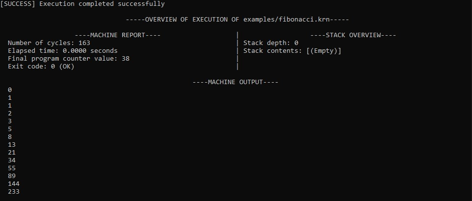

# KERN

<p align="center">
  
</p>

## Project Overview
Kern is a custom assembly language, bytecode compiler, and sandboxed bytecode interpreter built entirely from scratch in Python and C.

## Architecture Overview
Kern is split into two different layers. The first layer is a Python assembler that reads a .krn source file that is specified by the user. The assembler tokenizes it, then resolves labels using a two-pass algorithm, and lastly emits a flat binary .bin file, encoding the program as a sequence of bytes. <br>
The second layer is a C virtual machine that loads the .bin file, allocates a 256 byte sandboxed memory block, and executes the bytecode instruction by instruction using a fetch-decode-execute loop. <br>
If the program attempts an out of bounds memory access, causes a stack overflow/underflow, has invalid opcode, or any other violation, the VM intercepts it safely and halts with the diagnostic report informing you what went wrong rather than crashing.

## ISA Reference
You can view the ISA documentation [here](./isa.md).

## Getting started
Disclaimer: WSL/a Unix environment is required for this. You can install WSL very easily by following the official microsoft guide. If you don't have/don't want to install + set up WSL, there is a demo video linked after the "Examples" section. You can either scroll until you see it, or click [here](#video-demo "Goto video-demo"). <br>
Open the WSL terminal. Before starting, run the following command to update your package lists before you download/install anything (if you need to download anything):
```
sudo apt update
```
First, ensure make, gcc, and libc-dev are all installed. You can do this by running the following command:
```
sudo apt install make gcc libc-dev
```
Git should come installed by default with WSL, but if you don't have it, enter this command for the latest stable version of Git:
```
sudo apt install git
```
Next, install Python. You can do this by running the following command in the WSL terminal:
```
sudo apt install python3 python3-pip python3-venv
```
Once everything is installed, cd to the directory of your choice, and clone the repository using the following command (I would recommend doing it in the ~ directory to avoid any issues):
```
git clone https://github.com/griffitre/Kern.git
```
After the repo is cloned, run ```cd Kern``` in the terminal, and you will be in the root directory. Once there, run ```make build``` to make the executables, then run the following command to start the program:
```
python3 frontend/frontend.py
```
The program should start and you should see an input prompt. That's all for the setup!

## Usage
Disclaimer: WSL/a Unix environment is required for this. You can install WSL very easily by following the official microsoft guide. If you don't have/don't want to install + set up WSL, there is a demo video linked after the "Examples" section. You can either scroll until you see it, or click [here](#video-demo "Goto video-demo"). <br>
Using the program is very simple. All you do is type in the name of a source file into the input box and hit enter. The assembler assembles everything, the VM runs everything, then the overview is displayed. Passed files must end in ```.krn```. 


Though, if you'd like to run everything manually without the front end, you can do the following: <br>
Before starting, run ```make build``` to make the executables. <br>
First, run your source code file through the assembler using this command:
```
python3 assembler/src/assembler.py <file.krn>
```
This will output a .bin file in the same directory as the original file. Once you have the .bin file, run the following command to start the VM:
```
./vm/bin/kern <file.bin>
```
Once the VM is finished running, there will be two sections: the machine output section (the stuff above the telemetry header), and the telemetry/machine report (the stuff below the telemetry header).

## Examples
I have included 4 different example programs in the repo. I will go over them here.

### Countdown
The countdown.krn file. All it does it countdown from 10 to 0. Very simple. The VM prints all numbers. <br>
Here is the output by the VM:
```
10
9
8
7
6
5
4
3
2
1
0

----TELEMETRY----
Number of cycles: 93
Elapsed time: 0.0001 seconds
Stack depth: 0
Stack contents: [(Empty)]
Final program counter value: 24
0x00: 00 00 00 00 00 00 00 00 00 00 00 00 00 00 00 00
0x10: 00 00 00 00 00 00 00 00 00 00 00 00 00 00 00 00
0x20: 00 00 00 00 00 00 00 00 00 00 00 00 00 00 00 00
...
(Truncated this to keep the readme length small)
```

### Factorial
The factorial.krn file. It calculates the factorial of 5 (i.e. 5!). <br>
One thing of note is that since all values are 8-bit unsigned integers in this program, 6! and above will actually silently overflow. <br>
Here is the output by the VM:
```
120

----TELEMETRY----
Number of cycles: 46
Elapsed time: 0.0000 seconds
Stack depth: 0
Stack contents: [(Empty)]
Final program counter value: 24
0x00: 00 00 00 00 00 00 00 00 00 00 00 00 00 00 00 00
0x10: 00 00 00 00 00 00 00 00 00 00 00 00 00 00 00 00
0x20: 00 00 00 00 00 00 00 00 00 00 00 00 00 00 00 00
...
(Truncated this to keep the readme length small)
```

### Fault Demo
The faultDemo.krn file. This is meant to demonstrate what happens when there's an issue in the code and how the VM handles it. <br>
Here is the output by the VM:
```

----TELEMETRY----
Number of cycles: 2
Elapsed time: 0.0000 seconds
Stack depth: 0
Stack contents: [(Empty)]
Final program counter value: 5
0x00: 00 00 00 00 00 00 00 00 00 00 00 00 00 00 00 00
0x10: 00 00 00 00 00 00 00 00 00 00 00 00 00 00 00 00
0x20: 00 00 00 00 00 00 00 00 00 00 00 00 00 00 00 00
...
(Truncated this to keep the readme length small)
```
You'll probably notice that there's no error code or anything. This is because the VM returns an int to the frontend that tells the frontend the status of the execution. If you run this file through the front end, you'll see it tell you that the execution failed, and it will tell you exactly what error code was returned and what it means.

### Fibonacci
The fibonacci.krn file. It calculates the first 14 fibonacci numbers starting from 0, from F0 (which is 0) to F13 (which is 233). <br>
Once again, since all values are 8-bit unsigned integers, the next fibonacci number (377) would silently overflow, which is why I only chose to calculate the first 14. <br>
Here is the output by the VM:
```
0
1
1
2
3
5
8
13
21
34
55
89
144
233

----TELEMETRY----
Number of cycles: 163
Elapsed time: 0.0001 seconds
Stack depth: 0
Stack contents: [(Empty)]
Final program counter value: 38
0x00: 90 E9 00 00 00 00 00 00 00 00 00 00 00 00 00 00 
0x10: 00 00 00 00 00 00 00 00 00 00 00 00 00 00 00 00 
0x20: 00 00 00 00 00 00 00 00 00 00 00 00 00 00 00 00
...
(Truncated this to keep the readme length small)
```

## Video Demo
I've recorded a video demo just in case you would rather not set up WSL and install everything else, or if the program doesn't work even after following the setup. <br>
In the video, I go over how you run the program through the front end, as well as how you can run everything manually. I also make a small example file in my .krn langauge to walk through how you'd make one. <br>
You can see the video [here](https://youtu.be/jrbHvWxMWZE). <br>
Furthermore, you can also see a little example video where I make a program from scratch in the language [here](https://youtu.be/EDeMyFUXiHI).

## Project Structure
```
Kern/
├── assembler/              # Folder containing the assembler source code and test suites
│   ├── src/                # Contains assembler.py, which is the entire assembler
│   └── tests/              # Contains the unit tests for assembler.py to ensure everything functions correctly
├── examples/               # Contains 4 example programs demonstrating the system and its output
├── frontend/               # Contains frontend.py, which is the entire frontend
├── vm/                     # Folder containing the C-based Virtual Machine components
│   ├── include/            # Contains the C header files (.h files) for the VM components
│   ├── src/                # Contains the core C implementation (i.e. memory.c, stack.c, etc), as well as the telemetry
│   └── tests/              # Contains the test suites to ensure the VM functions correctly and as intended
├── .gitignore              # Intentionally untracked files to ignore
├── isa.md                  # ISA documentation (architecture, instructions, faults)
├── Makefile                # The Makefile used to build both the kern executable (the VM) and the VM test executable
└── README.md               # Project documentation/overview, setup/usage guide, and examples
```